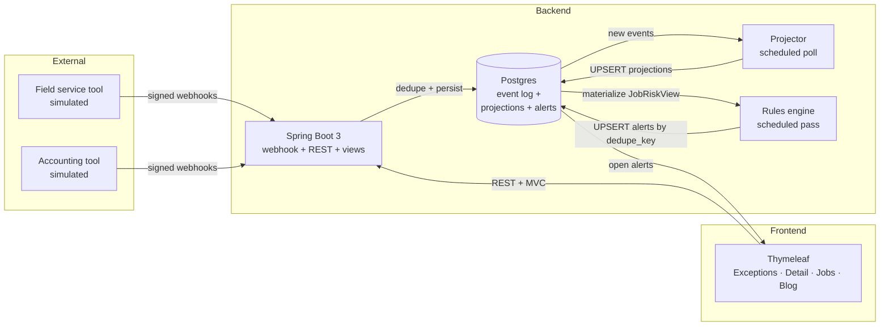
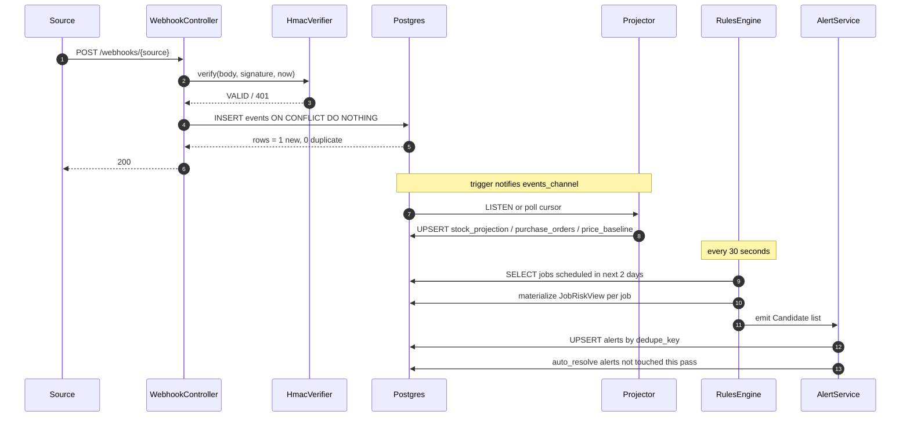

# Materials Exception Command Center

A small exception layer for contractor inventory. Signed webhooks land in an append-only event log, projections and confidence scores rebuild from the log, a rules engine evaluates every job scheduled in the next two weeks, and a dashboard lets an operations manager acknowledge or resolve the morning's risks. A deterministic **Replay** button rebuilds every derived table from the event log.

Two audiences in one product:

- **Operations manager** sees Today's Exceptions → alert detail → Acknowledge or Resolve
- **Backend engineer** opens Admin and sees the event log, circuit state per source, `dead_letters` entries, and a Replay endpoint

---

## Architecture



---

## Request flow



---

## Patterns

| Pattern | File | What it solves |
|---|---|---|
| **Idempotent webhook ingestion** | `webhook/WebhookController.java`, `events/EventStore.java` | Retry storms collapse to one row via `(source, external_id)` UNIQUE + `ON CONFLICT DO NOTHING RETURNING id` |
| **Signed webhook verification** | `webhook/HmacVerifier.java` | HMAC-SHA256 with `MessageDigest.isEqual` constant-time compare, timestamp skew guard to bound replay |
| **Event sourcing + replay** | `resilience/ReplayService.java` | `events` is source of truth; every projection rebuilds deterministically from it |
| **Handlers per event type** | `projection/StockProjectionUpdater.java`, `PoStateUpdater.java`, `PriceBaselineUpdater.java` | Clean extension point: a new event type is a new handler, not a new branch |
| **Online mean and variance** | `projection/PriceBaselineUpdater.java` | Welford's algorithm keeps the baseline in one pass without re-reading history |
| **Confidence scoring as pure function** | `confidence/ConfidenceScorer.java` | Recency + activity + source trust, weights sum to one, output in [0, 1], no model to debug |
| **Rules as pure functions** | `rules/RulesEngine.java`, `rules/*Rule.java` | Each rule reads a materialized `JobRiskView`, no I/O inside, trivially testable |
| **Deterministic alert identity** | `alerts/AlertService.java` | `dedupe_key` UNIQUE collapses repeated evaluations; human resolve is sticky, only `auto_resolved` reopens |
| **Circuit breaker per source** | `resilience/CircuitBreaker.java` | Opens after 5 consecutive `DataAccessException`s, cools down 60s, isolated per source |
| **Dead-letter queue** | `webhook/DeadLetterStore.java` | Malformed payloads persist with reason and raw body for replay after a fix |

---

## Tech stack

- **Backend:** Spring Boot 3.3, Java 21, Flyway, Postgres 16 (JSONB + generated UUIDs), Jackson
- **Frontend:** Thymeleaf, a small CSS file, no JS framework
- **Resilience:** circuit breaker with state in Postgres, projector replay, `dead_letters`
- **Dev:** Docker Compose, Dockerfile with multi-stage build, Testcontainers, railway.json

---

## Key trade-offs

Deliberate choices where "enough for now, clear path to scale later" beats "perfect now":

- **Postgres as the event log.** At current volume, an extra broker (Kafka, Kinesis) is operations overhead for no user-visible gain. The seam is clean; migration is a consumer-group change, not a schema one.
- **Single tenant.** Adding `tenant_id` columns and an edge filter is a day of work; the product shape does not change. Not worth doing here.
- **Scheduled rules every 30 seconds.** Fine for the morning flow of an operations manager. Firing rules on each new projector notification is a next step if the latency ever matters.
- **Synthetic webhooks, not real ServiceTitan.** A production integration needs sandbox credentials. The envelope shape matches the pattern real sources use, so an adapter is one file per source.
- **Six rules shipped, two deferred.** `TransferNotCompletedRule` and `ConflictingLocationStateRule` require correlation across events and do not fit cleanly into a view built per job. Documented rather than forced in.
- **No ML.** Rules plus confidence scoring for explainability. A small local classifier for anomaly scoring is a next step once a year of events has accumulated.

---

## Quickstart

```bash
# 1. infra + app on port 8080, postgres on 5433
docker compose up --build

# 2. open the dashboard
open http://localhost:8080/exceptions
```

The `dev` profile seeds 5 items, 4 locations, 10 jobs spread across the next 10 days, and about 30 events spanning the last month. Rules evaluate on startup and every 30 seconds after. You should see around 20 open alerts covering each of the six rule types.

Push your own signed event:

```bash
SECRET=local-dev-secret-rotate-me
T=$(date +%s)
BODY='{"external_id":"evt_x","type":"STOCK_SCAN","occurred_at":"2026-04-22T08:00:00Z","payload":{"sku":"BRK-20A","location":"truck_8","qty":5}}'
SIG=$(printf "%s.%s" "$T" "$BODY" | openssl dgst -sha256 -hmac "$SECRET" -hex | awk '{print $2}')
curl -X POST http://localhost:8080/webhooks/fsm \
  -H "Content-Type: application/json" \
  -H "X-Ply-Signature: t=$T, v1=$SIG" -d "$BODY"
```

Endpoints worth clicking: `/exceptions`, `/exceptions/{id}`, `/jobs`, `/blog/event-sourced-exceptions`, `/api/alerts`, `/api/jobs/at-risk`, `/admin/replay` (POST), `/admin/circuit`, `/admin/dlq`.

---

## Tests

```bash
docker run --rm \
  -v "$PWD":/workspace -w /workspace \
  -v /var/run/docker.sock:/var/run/docker.sock \
  -v "$HOME/.m2":/root/.m2 \
  -e TESTCONTAINERS_HOST_OVERRIDE=host.docker.internal \
  --add-host=host.docker.internal:host-gateway \
  maven:3.9.9-eclipse-temurin-21 mvn -B test
```

73 JUnit and Testcontainers cases. Webhook idempotency (10× same envelope → 1 row, P99 under 50ms). HMAC verifier across valid, tampered body, wrong secret, expired timestamp, malformed header. Controller covers signed duplicate at 200, bad signature at 401, malformed JSON at 400 + DLQ row. Stock projector replays a mixed stream of scan, transfer, part-used, adjustment, and reconstructs per-location qty to hand-computed expected. Welford's online variance across 10 quotes matches the offline formula within 0.005. Six rules each have a positive and a negative. Alert lifecycle covers open → acknowledged → resolved, auto-resolve on candidate drop-out, sticky human close. Circuit breaker opens after 5 failures and isolates per source. Replay rebuilds projection and alerts idempotently.

---

## Deploy

Railway detects the `Dockerfile` and `railway.json`. Add a Postgres plugin. Set `DATABASE_URL` to the `jdbc:postgresql://...` form (not the `postgresql://` one Railway injects by default), set `DATABASE_USERNAME` and `DATABASE_PASSWORD`, and set `WEBHOOK_SIGNING_SECRET` to a rotated value. Do **not** set `SPRING_PROFILES_ACTIVE=dev` in production; that activates a seeder that writes synthetic jobs and events. Health at `/actuator/health`. First build takes about three minutes for Maven deps to download.

---